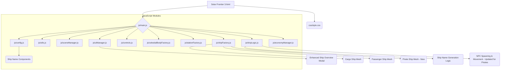

# Project Enhancement Plan: Solar Frontier NPC & Refactor (Refined)

This plan outlines the steps to refactor the existing codebase, enhance NPC ship visualization and information (including a new Pirate ship type and name generation), and update the existing Ship Overview menu.

## Phase 1: Code Refactoring & Initial Setup

This phase focuses on creating a more maintainable and organized codebase.

1.  **Separate CSS:**
    *   Create `css/style.css`.
    *   Move all CSS rules from `<style>` tags in `Solar Frontier 3.html` into `css/style.css`.
    *   Link `css/style.css` in the `<head>` of `Solar Frontier 3.html`.
2.  **Prepare HTML for JavaScript Modules:**
    *   Modify the `<script>` tag in `Solar Frontier 3.html` to be of `type="module"` and point to a new main JavaScript file, e.g., `js/main.js`.
3.  **Create JavaScript Module Structure:**
    *   Create a `js` directory.
    *   Inside `js`, create the following initial empty files:
        *   `js/main.js`: Main application entry point, `init()` and `animate()` loop.
        *   `js/config.js`: Static data (planetsData, commoditiesMasterList, stationsData, ship name components, etc.).
        *   `js/utils.js`: Utility functions.
        *   `js/sceneManager.js`: Three.js scene setup, camera, renderer, lighting, background stars.
        *   `js/uiManager.js`: DOM element interactions, modal management (including Ship Overview), info box updates.
        *   `js/controls.js`: Keyboard and mouse event handlers.
        *   `js/celestialBodyFactory.js`: Functions for creating sun, planets, moons, asteroids, comets.
        *   `js/stationFactory.js`: Functions for creating different station types.
        *   `js/shipFactory.js`: Functions for creating NPC ship meshes (Cargo, Passenger, Pirate).
        *   `js/shipLogic.js`: NPC ship spawning, movement, status updates, and name generation.
        *   `js/economyManager.js`: Market logic, commodity updates, passenger mission generation.
4.  **Migrate JavaScript Code:**
    *   Systematically move JavaScript code from `Solar Frontier 3.html` into the appropriate modules.
    *   Update function calls and variable references to use ES6 module `import`/`export` syntax.

## Phase 2: NPC Ship Enhancements (Refined)

1.  **Ship Name Generation (in `js/shipLogic.js` & `js/config.js`):**
    *   **Data (`js/config.js`):**
        *   Define arrays for ship name components:
            *   `SHIP_NAME_PREFIXES = ["Star", "Void", "Trade", "Swift", "Solar", "Nova", "Cosmic", "Light", "Dark", "Iron"]`
            *   `SHIP_NAME_CORES_CARGO = ["Hauler", "Freighter", "Barge", "Carrier", "Merchant", "Transporter"]`
            *   `SHIP_NAME_CORES_PASSENGER = ["Liner", "Cruiser", "Yacht", "Shuttle", "Clipper", "Voyager"]`
            *   `SHIP_NAME_CORES_PIRATE = ["Marauder", "Reaver", "Pillager", "Raider", "Corsair", "Cutlass"]`
            *   `SHIP_NAME_SUFFIXES = ["Alpha", "Beta", "Gamma", "Delta", "Prime", "MK II", "MK III", "LX", "GT", "X"]` (Can be numeric IDs too)
    *   **Logic (`js/shipLogic.js`):**
        *   Create a function `generateShipName(shipType)`:
            *   Select a core name list based on `shipType` (Cargo, Passenger, Pirate).
            *   Randomly pick one prefix, one core name, and one suffix (or generate a random number/letter sequence for the suffix).
            *   Example: `return \`\${randomPrefix} \${randomCore} \${randomSuffix}\`;"`
        *   In `spawnNewShip`, call `generateShipName` and store the result in `shipMesh.userData.displayName` (new property).
2.  **Enhanced Ship Visuals (in `js/shipFactory.js`):**
    *   Modify `createCargoShipMesh` and `createPassengerShipMesh` to have more distinct geometric silhouettes while retaining the wireframe look.
        *   **Cargo:** Emphasize bulkiness, perhaps more container-like structures.
        *   **Passenger:** Sleeker, perhaps with more defined "window" areas or a more aerodynamic shape.
    *   Create a new function `createPirateShipMesh()`:
        *   Design a visually distinct silhouette: more angular, perhaps asymmetrical, or with visible "weapon" like protrusions. Use basic geometries like `THREE.BoxGeometry`, `THREE.CylinderGeometry`, `THREE.ConeGeometry`.
        *   Ensure it also includes `THREE.EdgesGeometry` for the wireframe.
    *   Update `spawnNewShip` in `js/shipLogic.js` to include "PIRATE" as a possible `shipType` and call `createPirateShipMesh` accordingly.
3.  **Enhance Ship Overview Modal (in `js/uiManager.js`):**
    *   Modify the `openShipOverviewModal` function and the corresponding HTML table structure.
    *   **Table Columns:**
        *   Change the "ID" column to "Name" and display `ship.mesh.userData.displayName`.
        *   Keep "Type", "Origin", "Destination", "Progress", "Status", "ETA (sim sec)".
    *   **Data Population:**
        *   Ensure the `activeShips` objects in `js/shipLogic.js` have the `displayName` property correctly populated.
        *   When populating the table in `openShipOverviewModal`, use this `displayName`.

## Phase 3: Integration and Testing

1.  **Update `init()` and `animate()`:**
    *   Ensure `js/main.js` correctly calls initialization functions from other modules and that the `animate` loop updates all systems.
2.  **Testing:**
    *   Thoroughly test all functionalities: simulation, UI interactions, NPC spawning (including new pirate types), ship movements, market, new ship names, and the updated Ship Overview menu.
    *   Verify that the refactoring hasn't introduced regressions.

## Mermaid Diagram: File Structure & Dependencies

## Libraries to Import:

*   **Three.js & OrbitControls:** Currently used via CDN. For a modular approach, consider managing these via npm and importing them directly into JavaScript modules in the future.
*   No other new libraries are strictly required for the planned features.